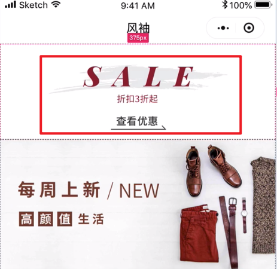

## 页面规划
页面的`js`文件不应该做业务逻辑，应该作页面的数据绑定，它是业务逻辑层的桥梁。

这里面分离出来了一个业务层`model`，在里面写`js`。

如果我们在里面新建一个`home.js`，严格意义上讲，它不是一个业务对象，那什么是一个业务对象，那我们请求的是不是一个主题，那`theme`就是一个业务对象。

## 命名
获取如下红框中的信息，这个接口的函数名应该怎么写？

用业务较强的命名方式`getSaleTheme`，这样不太合适，如果日后这个区域的内容不是`sale`了，那这样不就不合适了。

这里也不能用`getTopTheme`，`home`页面中有好几个`sale`，难不成命名成`getMiddleTheme`，`getBottomTheme`，显然这样也不合适。

这里推荐的命名方式是按区域划分，可以用`1`、`2`、`3`...或者`A`、`B`、`C`...来命名，可以用`getLocationA`来命名，这个函数名通用性比较强，可以在加上页面的名字`getHomeLocationA`。

## 主题模块化
完成顶部`sale`主题后，是不是要写详情页面，我们必须要从整体的角度来看待问题，现在就写详情页面很容易会打断我们的连贯思维，首页是一个整体，我们应该从上到下把首页的各个专题和`banner`都完成，然后在逐一集中精力在写每一个的详情，这个顺序才是真正在开发的一个顺序。如果写一个封面就写一个详情，那时相当麻烦的，可不是展示一个封面那么简单，它很容易把你整体思维给破坏掉，所以应该先把首页的整体完成，再写单个的详情。

正是我一口气把首页全部完成之后，才产生要写主题模版的想法，因为我写完后发现，每个主题要跳到一个页面去，但是如果考虑主题的复用性，这些主题不应该用页面的的方式展现，而是用主题模版的概念来展现，写到后面会发现，其实我们主题内部的详情，都是一个个的主题模版，这里总共做了`4`个主题模版，后面在写详情页面的时候，就不需要在编写的，直接使用写好的主题模版就行了，在`cms`中配置某一个主题以及它要使用的模版，前端就会自动的把相关的主题的商品进行模板化。

## `package.json`中的一些规则

`package.json`中，`dependencies`中的语法是`semver`，一个组件的版本号有三位`0.0.0`，第一位是主要版本号，第二位是次要版本号，第三位是补丁版本号。例子：`~0.6.0`使用最新的补丁版本号，`^0.6.0`使用最新的次要版本号，`latest`永远使用最新的版本号

## 组件设计原则

* 你必须在组件的灵活性和易用性之间或者稳定之间做出一个选择，找到一个平衡点
  * 灵活性的组件它的稳定性是偏差的，灵活性越高，上手和使用难度越大

## 组件到底意义是什么

1. 样式：避免写重复的样式
2. 骨架：避免写一些重复的标签
3. 业务逻辑/行为

灵活性：
1. 外部样式类
2. `slot`插槽

兼顾灵活性和易用性，设置默认值：样式默认值，插槽默认值

## 优惠券

前端做的功能：核算、过期。

类型：满减、折扣、使用条件

优惠券分为领取和使用