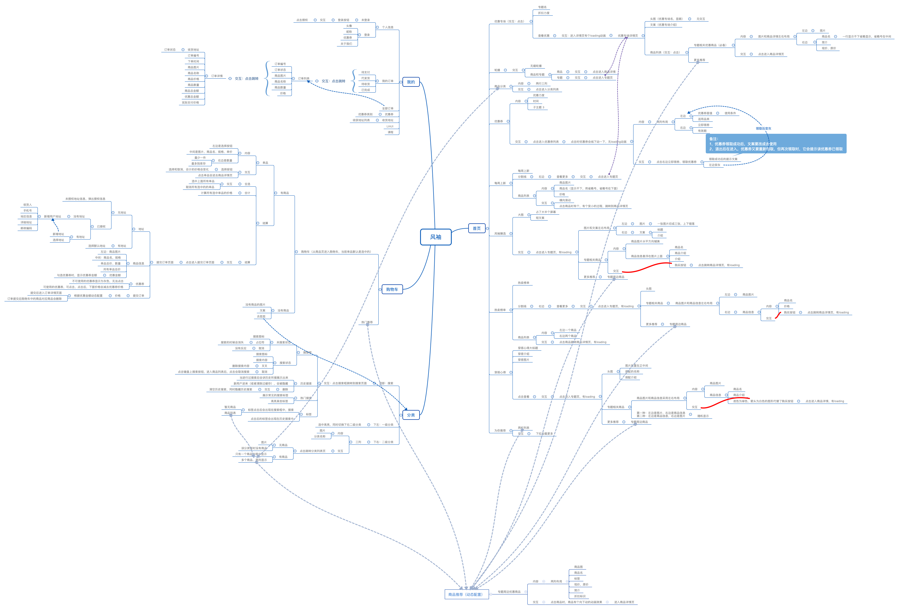

七月老师一贯的风格就上让学员在看视频之前自己动手做一下，他一直给我们传达的信息是不要给自己贴上前端还是后端的标签，20岁时可以靠技术走天下，那到了30岁呢，你该怎么办？

他给我们布置的第一个作业，自己体验一下风袖小程序，并梳理功能，整理成思维导图。

下面是我大致梳理的功能，自己做下来之后才发现，这个作业不简单：
1. 从时间上来说，梳理功能并绘制成思维导图，我用了3个多小时，也只是梳理了一部分（没有做的商品详情页，做一半的是订单页面）。
2. 刚开始做的时候，只是看页面有什么就写什么，写着写着发现，布局不一样，交互不一样，能给人带来不一样的体验，这我刚开始的时候没有考虑到这一点。
3. 产品细节是真多，如果把细节考虑全面的话，保守估计还需要这么长时间。
4. 要有好原型框架，我做的太混乱了。

做这个作业我也有很大的收获，通过这样的整理，我了解了这个小程序基本功能，这对后续的学习有一个很好的帮助，同时也培养了我的产品观。

新人刚进公司，整理文档是最好的一种方式，我刚开始知道这个方式的时候不知道怎么执行，通过这个作业，我知道了前端可以从梳理功能开始，把自己梳理的功能整理成思维导图，这也是快速掌握业务逻辑的方法。